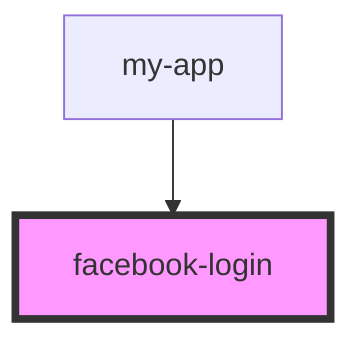

# facebook-login

<!-- Auto Generated Below -->

## Properties

| Property    | Attribute   | Description | Type      | Default     |
| ----------- | ----------- | ----------- | --------- | ----------- |
| `animation` | `animation` |             | `boolean` | `undefined` |
| `text`      | `text`      |             | `string`  | `undefined` |
| `type`      | `type`      |             | `string`  | `undefined` |
| `variant`   | `variant`   |             | `string`  | `undefined` |
| `width`     | `width`     |             | `string`  | `undefined` |

## Dependencies

### Used by

 - [my-app](../my-app)

### Graph

----------------------------------------------

*Built with [StencilJS](https://stenciljs.com/)*
